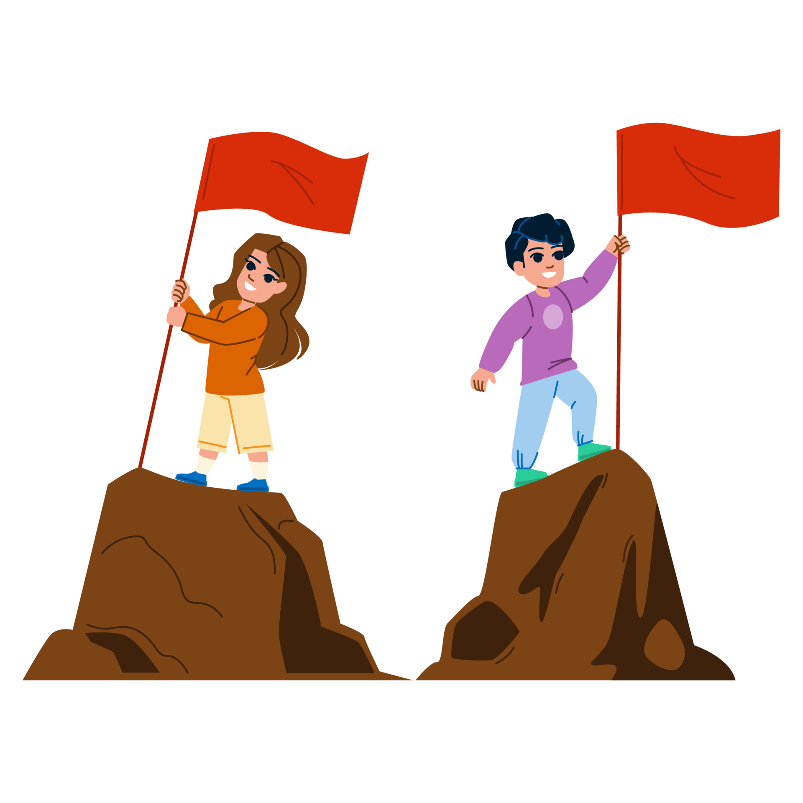
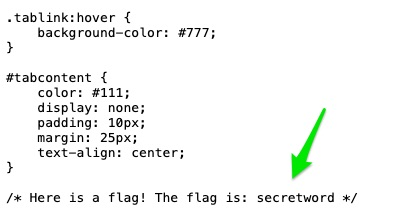
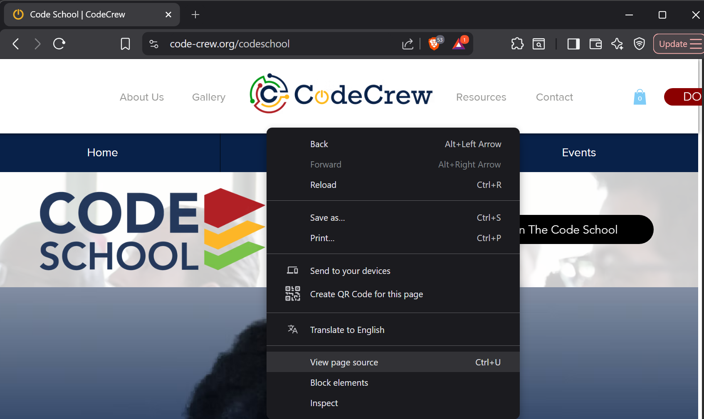

# Explore Software Development Workshop and Challenge Repo

## Welcome to CodeCrew!

Let's get better acquainted with each other and computing by playing Capture the Flag!

What is Capture the Flag?

In cybersecurity, a Capture The Flag (CTF) competition is where participants solve various security challenges to capture hidden "flags" or pieces of information. CTFs are fun, practical learning experiences that simulate real-world cybersecurity scenarios. Within this lesson, you will have the opportunity to find "flags" by locating specific information using the View Page Source feature as well as other features that you will learn about. A flag is a secret word hidden somewhere on the site. Here is an example:

Keep track of all the flags you find!

Good luck!

## Page Source Code
Did you know that you can see the underlying programming code of any web page? Could this be a potential risk? Could cybercriminals use this in a malicious way?

screenshot showing the View Page Source option in the right-click menu

The "view page source" option on a browser allows you to view the HTML, CSS, and JavaScript code that is being used to display the content you see. This option lets you peek behind the scenes and see the actual code that makes up the webpage!

It's a handy tool for understanding how different elements on a page are structured and styled, but could this be a potential risk? What important information might be stored in the code of a webpage?

### Your Task

Right-click on this page and choose View Page Source (If your right-click is disabled, copy and paste this into your web browser: view-source:https://CodeCrew-CodeSchool.github.io/esd/site/index.html
What do you see? Anything interesting?

## Find the Flags!

In this activity, you will find four flags (and an optional bonus flag) hidden somewhere within the website. Each flag will include a word. Keep track of the words.

Open the site in a new tab: <a target="_blank" href="https://CodeCrew-CodeSchool.github.io/esd/site">Capture the Flag Site</a>

1. The first flag is hidden in the site's source code. Use the View Page Source feature to find it. If your right-click is disabled, copy and paste this into your web browser: view-source:https://CodeCrew-CodeSchool.github.io/esd/site/index.html

2. In the source code, there is a **style.css** file. Search this file for the second flag. Take note of the web address of this file. How is it different than the original website?

3. In the source code, there is also a **script.js** file. Search this file for the third flag. Look at the web address here as well. What is the only part of the address that is different in each file?

4. Lastly, there is another file that is NOT listed on the website or in the source code. You can only access this file by typing it in the web address bar. To find this file, unscramble the following word and place it in the web address in the format shown:

Unscramble this word: eteceditv
Use the following format to navigate to the hidden file. Replace the blank before .txt with the unscrambled word and go to that site:

https://code-crew.org/___________.txt

5. Advanced Bonus Flag (Optional): Right-click on the image of the cat and save the file to your desktop. Open the file with a text editor (either Notepad on a Windows computer or TextEdit on a Mac). Find the bonus flag!

The 5 flags are:

1.__________

2.__________

3.__________

4.__________

5.__________

## Take Home

### Console Secrets

In this activity, you will explore the console using the developer tools to find two flags!

<iframe loading="lazy" onload="self.scrollTo(0,0)" width="560" height="315" class="slides" src="https://docs.google.com/presentation/d/1GVOoisApJDNckEKJ2xMGhfmOc2UIm7whwUasDgd_KH4/embed?start=false&amp;loop=false&amp;delayms=15000" frameborder="0" allowfullscreen="true" mozallowfullscreen="true" webkitallowfullscreen="true"></iframe>

Open this site in a new tab: <a target="_blank" href="https://CodeCrew-CodeSchool.github.io/esd/site/console/index.html">Console Secrets</a>

Using your developer tools, go to the console and follow the directions.
Write down the flag words that you find along the way!

If your developer tools are disabled, click on this link to complete a similar activity: <a target="_blank" href="https://CodeCrew-CodeSchool.github.io/esd/site/altconsole/index.html">Simulated Console Secrets</a>

#### Reflection:

1. Warning messages and errors are listed in the console. Why might the developer of the website be interested in knowing these?

2. Why might a cyber criminal be interested in knowing a website's errors?

### Local Storage

In this activity, you will explore local storage using the developer tools to find one more flag!

Open this site in a new tab: <a target="_blank" href="https://CodeCrew-CodeSchool.github.io/esd/site/localstorage/index.html">Local Storage</a>

Using your developer tools, go to the console and follow the directions.
Write down the flag word that you find along the way!

If your developer tools are disabled, click on this link to complete a similar activity: <a target="_blank" href="https://CodeCrew-CodeSchool.github.io/esd/site/altlocalstorage/index.html">Simulated Local Storage</a>

#### Reflection:

1. What could be a risk of keeping information in local storage?

2. How could you ensure that the information stored in local storage is secure?

<!-- Credit to CodeHS for the lesson plan. -->

# Submission

Edit this file, providing the 5 flags you've found, and the answers for each of the reflection questions.

Use Visual Studio Code to send your updates back to your Github repo. 

Email the link to your updated Github Repo to: 
